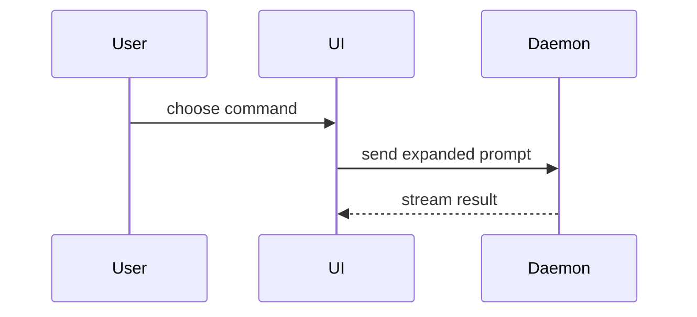

Answer the question on the table with the smallest view that makes the point clear. Skip the preamble and keep the prose short. Put each visual next to the one or two sentences it supports.

- Show logic or an algorithm as pseudocode:

```text
on(save)
  if content is unchanged
    return cached result
  write new content
  return fresh result
```

- Show runtime control flow as a call tree:

```text
submitForm
  createSession
    persistPrompt
    launchAgent
  navigateToSession
```

- Show UI structure as a component tree, with the state and module boundaries that matter:

```tsx
<SessionPage> (apps/example/src/routes/session.tsx)
  useSessionEvents()
  <SessionToolbar>
    <RunSkillButton> (packages/ui)
```

- Show file responsibility or a broad refactor as a shallow file tree:

```text
src/
├── commands/       # parses user actions
├── sessions/       # owns session state
└── transport/      # sends API requests
```

- Show component interaction or data flow with Mermaid:



### Make the diagram fit before you send it

The TUI draws the diagram as box art. It drops back to the raw Mermaid source, with no warning, when the art is wider than the message area. A wide sequence diagram is the usual cause, because the width is about `(participants - 1) * (longest label + 2) + 6`. Six participants with 36-character labels need 194 columns.

The renderer also drops back to source for a diagram type it does not draw. It draws `flowchart` and `graph` (including `subgraph`), `sequenceDiagram`, `stateDiagram`, `classDiagram`, and `erDiagram`. Nothing else.

Run the checker on every Mermaid block before you put it in an answer:

```bash
cat > /tmp/show-me.mmd <<'EOF'
<diagram source>
EOF
node ~/.pi/agent/skills/show-me/mermaid-fit.mjs /tmp/show-me.mmd
```

The last line is the verdict: `OK width=N limit=L`, `TOO WIDE width=N limit=L`, or `FAIL <cause>`. Exit code 0 means that the TUI draws it. The limit comes from the tmux pane width, and `--width N` overrides it.

On `TOO WIDE`, cut participants, shorten labels, or switch to `flowchart TD`, which is far narrower than a sequence diagram of the same content. On `FAIL`, fix the syntax or pick a supported type. Send the block only after the checker passes.

Keep Mermaid labels free of HTML. The renderer prints `<br/>` literally inside the box instead of breaking the line, so write two `Note over` lines or shorten the label.

- Use `diff` when the point is what changes and the surrounding shape already exists. Match the diff shape to the topic.

For a component change:

```diff
 <SessionPage>
   useSessionEvents()
   <SessionToolbar>
+    <RunSkillButton />
   <SessionTimeline>
+    <SkillResultCard />
```

For a file-layout change:

```diff
 src/
 ├── commands/
+│   └── show-me.ts       # expands the slash command
 ├── sessions/
-└── transport.ts
+└── transport/
+    ├── client.ts
+    └── stream.ts
```

For a call-tree change:

```diff
 submitForm
   createSession
     persistPrompt
+    expandSkillMention
     launchAgent
-  navigateToSession
+  navigateToSession
+    subscribeToEvents
```

For a state or control-flow change:

```diff
 on(save)
-  write content
+  if content is unchanged
+    return cached result
+  write new content
+  invalidate cache
```

- Show the whole block when most of it is new, when the omitted context hides ownership or order, or when the user needs a copyable target shape:

```ts
function expandSkill(command: string): string {
  const skillName = command.slice(1);
  return `use the ${skillName} skill`;
}
```

- For a visual layout, a state comparison, or a concept too dense for Mermaid, write one focused HTML file. Pick a diagram, an infographic, or a short slide deck, whichever fits the point. Match the product colors, type, spacing, and components. Use real labels and real data, and support desktop and mobile. Write the file to a temporary path unless the user names one, so that the repository stays clean, then open it in the browser:

```
open /tmp/show-me-{topic}.html
```

## Judgement

Keep only the calls, files, props, states, and boundaries that answer the current question or that separate the options under discussion. Cut the rest.

One form usually carries the point. Several are sometimes right. All of them never are.
